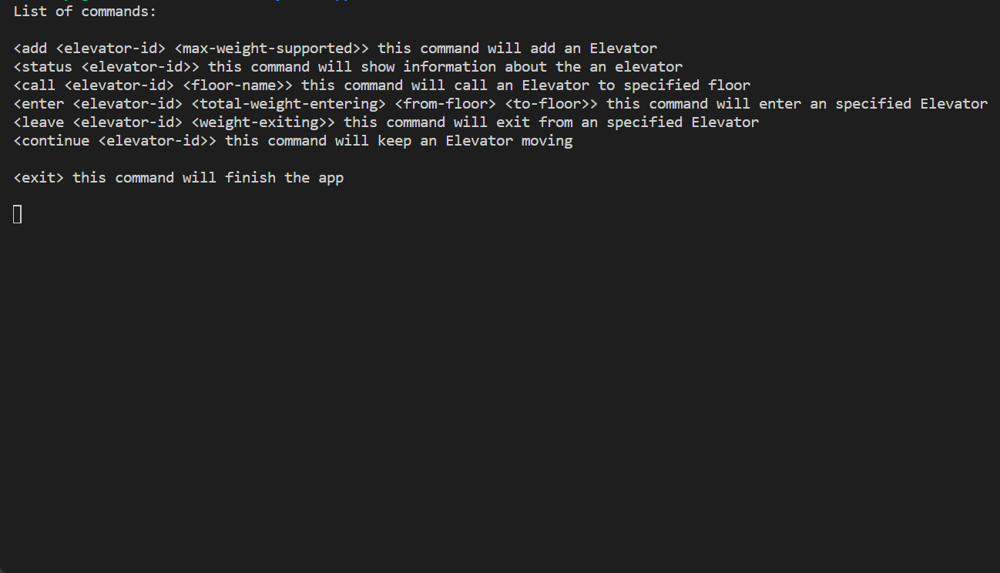

# About the Elevator System Challenge

This is a challenge you can find in this [link](https://drive.google.com/file/d/1EF5aWV69ed46AmR7SU4RcbjqiKRvY6mE/view).
The description of the challenge is basically the following:
* Create via command line the simulation of a real life elevator
* Let the user be able to create elevators and attach a maximum weight capability to it
* Permit the user to call an elevator in a given floor
* Permit the user enters the elevator with a given weight
* Permit the user leaves the elevator with a given weight
* Notify the user about the status of the elevator (stopped, moving down/up)
* Continue the elevator movement to the next floor that was called (I've used thread.sleep to simulate its phisical movement)

## Technologies/Data Structures used in this challenge
* Deque (Data structure to works with queues)
* String (Data structure to hold a vector of chars)
* Map (key value)
* Cmake and Make (to build the project)
* String Stream (to extract values from strings)
* OOP

## Dependencies for Running Locally
* cmake >= 3.7
  * All OSes: [click here for installation instructions](https://cmake.org/install/)
* make >= 4.1 (Linux, Mac), 3.81 (Windows)
  * Linux: make is installed by default on most Linux distros
  * Mac: [install Xcode command line tools to get make](https://developer.apple.com/xcode/features/)
  * Windows: [Click here for installation instructions](http://gnuwin32.sourceforge.net/packages/make.htm)
* gcc/g++ >= 5.4
  * Linux: gcc / g++ is installed by default on most Linux distros
  * Mac: same deal as make - [install Xcode command line tools](https://developer.apple.com/xcode/features/)
  * Windows: recommend using [MinGW](http://www.mingw.org/)

## Basic build instructions

1. Clone this repo.
2. Run the following command on root directory of the project `mkdir build && cd build`.
3. Inside build directory compile and generate its executable with `cmake .. && make`.
4. Run it: `./Elevator`.
